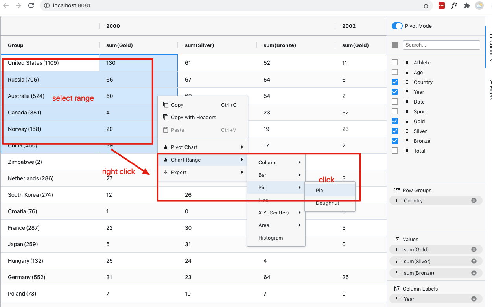

TypeScript React "Ag Grid" Pivot Table Demo
===================================

Pivot mode: group columns, aggregate values. Enterprise feature.

```
npm install
npm run demo
```

It will open page on browser automatically.





